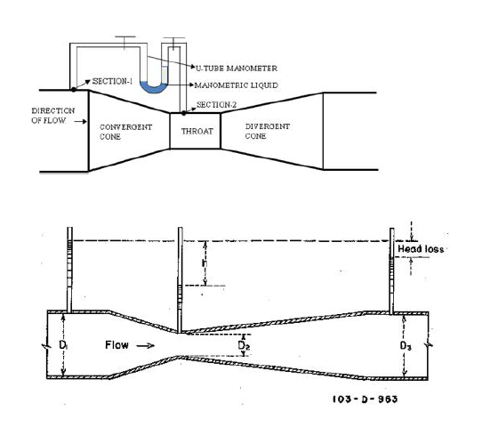

A Venturi meter is a differential pressure flow-measuring device used to determine the discharge of a fluid flowing through a closed conduit. It operates on the principles of the continuity equation and Bernoulli's theorem. The Venturi meter is widely used in hydraulic systems because of its simple construction, high accuracy, and low energy loss.

The basic principle of a Venturi meter is that when a fluid flows through a pipe of varying cross-sectional area, its velocity changes, causing a corresponding change in pressure. As the fluid enters the converging section of the meter, the flow area decreases and the fluid velocity increases. According to Bernoulli's theorem, an increase in velocity results in a decrease in pressure. The pressure reaches its minimum value at the throat, which is the section of minimum cross-sectional area. As the fluid passes through the diverging section, the velocity decreases and part of the pressure is recovered.

Bernoulli's equation states that the total mechanical energy of a steady, incompressible, and frictionless fluid flowing along a streamline remains constant. For two sections of a Venturi meter, the equation can be written as

$$
\frac{P_1}{\rho g}
+
\frac{V_1^2}{2g}
+
Z_1
===

\frac{P_2}{\rho g}
+
\frac{V_2^2}{2g}
+
Z_2
$$

Where:

- $P$ = Pressure of the fluid, $\mathrm{N/m^2}$,
- $\rho$ = Density of the fluid, $\mathrm{kg/m^3}$,
- $V$ = Velocity of flow, $\mathrm{m/s}$,
- $g$ = Acceleration due to gravity, $\mathrm{m/s^2}$,
- $Z$ = Elevation above a reference datum, $\mathrm{m}$.

For a horizontal Venturi meter,

$$
Z_1 = Z_2,
$$

and the equation simplifies to

$$
\frac{P_1}{\rho g}
+
\frac{V_1^2}{2g}
================

\frac{P_2}{\rho g}
+
\frac{V_2^2}{2g}.
$$

The continuity equation states that the rate of flow remains constant throughout the pipe and is given by

$$
Q=A_1V_1=A_2V_2,
$$

where

- $Q$ = Discharge through the pipe,
- $A_1$ = Cross-sectional area at the inlet,
- $A_2$ = Cross-sectional area at the throat,
- $V_1$ = Velocity at the inlet,
- $V_2$ = Velocity at the throat.

Combining the Bernoulli equation with the continuity equation, the theoretical discharge through the Venturi meter is obtained as

$$
Q_t=
\frac{A_1A_2}{\sqrt{A_1^2-A_2^2}}
\sqrt{2gh},
$$

where

- $h$ = Differential head between the inlet and the throat.

In practice, energy losses due to friction and turbulence slightly reduce the actual discharge. Therefore, the actual discharge is related to the theoretical discharge by the coefficient of discharge,

$$
C_d=\frac{Q_a}{Q_t},
$$

where

- $Q_a$ = Actual discharge,
- $Q_t$ = Theoretical discharge.

The coefficient of discharge is generally close to unity for a well-designed Venturi meter, making it one of the most accurate flow-measuring devices used in hydraulic engineering.

A typical Venturi meter consists of three principal sections:

1. **Converging section:** Gradually reduces the flow area, increasing the fluid velocity and decreasing the pressure.
2. **Throat:** A short section of uniform diameter where the velocity is maximum and the pressure is minimum.
3. **Diverging section:** Gradually increases the flow area, reducing the velocity and recovering part of the pressure energy.

Pressure taps are provided at the inlet and throat sections to measure the pressure difference using a manometer.

<em>Figure 1: Schematic representation of a Venturi meter showing converging section, throat, and diverging section.</em>

The experimental setup consists of a Venturi meter installed in a pipeline connected to a water supply system. Pressure taps are connected to a differential manometer to measure the pressure difference between the inlet and throat sections. Water flowing through the meter is collected in a measuring tank to determine the actual discharge, while the theoretical discharge is calculated using Bernoulli's equation and the continuity equation. The ratio of the actual discharge to the theoretical discharge gives the coefficient of discharge of the Venturi meter.

The Venturi meter is extensively used in water supply systems, irrigation networks, industrial pipelines, and hydraulic laboratories for accurate measurement of fluid flow rates with minimal head loss.
